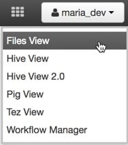
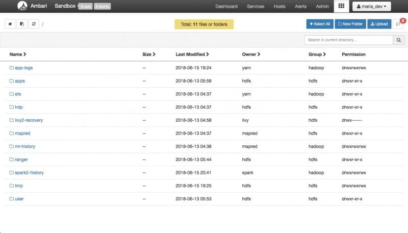
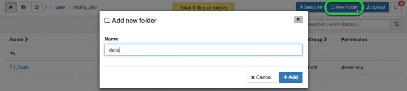
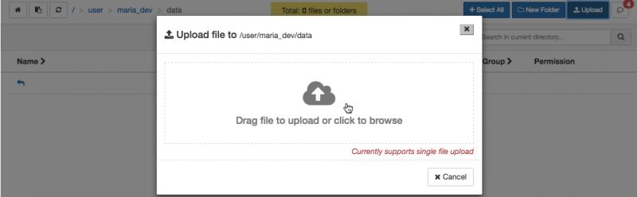
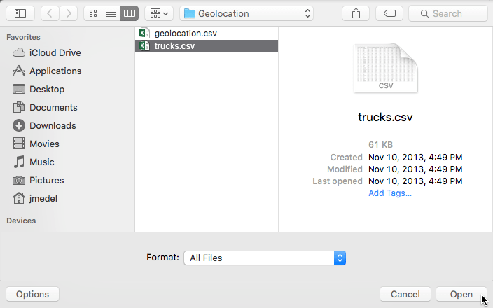
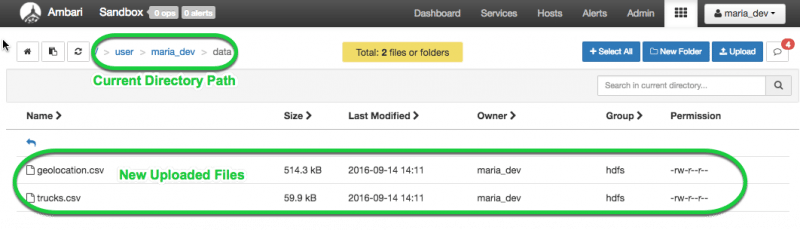
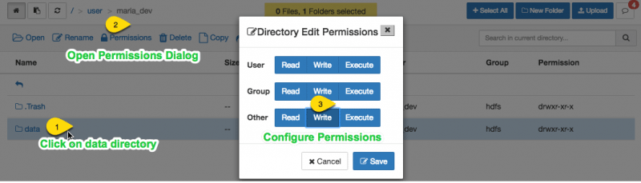

## 将传感器数据加载到HDFS中

## 介绍

在本节中，您将下载传感器数据并使用Ambari用户视图将其加载到HDFS中。您将了解Ambari文件用户视图以管理文件。您可以执行创建目录，导航文件系统和将文件上载到HDFS等任务。此外，您还将执行一些其他与文件相关的任务。获得基础知识后，您将创建两个目录，然后使用Ambari文件用户视图将两个文件加载到HDFS中。

## 先决条件

本教程是使用Hortonworks沙箱开始使用HDP的系列教程的一部分。在继续本教程之前，请确保完成先决条件。

- 已下载并已安装[Hortonworks Sandbox](https://zh.hortonworks.com/downloads/#sandbox)
- [学习HDP沙箱的线索](https://zh.hortonworks.com/tutorial/learning-the-ropes-of-the-hortonworks-sandbox/)

## 大纲

- [HDFS背景](https://zh.hortonworks.com/tutorial/hadoop-tutorial-getting-started-with-hdp/section/2/#hdfs-backdrop)
- [步骤1 - 下载并提取传感器数据文件](https://zh.hortonworks.com/tutorial/hadoop-tutorial-getting-started-with-hdp/section/2/#step1.1) - [**Geolocation.zip**](https://raw.githubusercontent.com/hortonworks/data-tutorials/master/tutorials/hdp/hadoop-tutorial-getting-started-with-hdp/assets/datasets/Geolocation.zip)
- [步骤2 - 将传感器数据加载到HDFS](https://zh.hortonworks.com/tutorial/hadoop-tutorial-getting-started-with-hdp/section/2/#step1.2)
- [概要](https://zh.hortonworks.com/tutorial/hadoop-tutorial-getting-started-with-hdp/section/2/#summary-lab1)
- [进一步阅读](https://zh.hortonworks.com/tutorial/hadoop-tutorial-getting-started-with-hdp/section/2/#further-reading)

## HDFS背景

随着数据的增长，单个物理机器的存储容量已经饱和。这种增长推动了跨不同计算机对数据进行分区的需求。这种管理机器网络数据存储的文件系统称为分布式文件系统。[HDFS](https://zh.hortonworks.com/blog/thinking-about-the-hdfs-vs-other-storage-technologies/)是Apache Hadoop的核心组件，旨在存储具有流数据访问模式的大型文件，在商用硬件集群上运行。借助Hortonworks数据平台（HDP），HDFS现已扩展为支持HDFS集群内的[异构存储](https://zh.hortonworks.com/blog/heterogeneous-storage-policies-hdp-2-2/)介质。

## 第1步 - 下载并提取传感器数据文件

1. 下载压缩（.zip）文件夹中包含的样本传感器数据：   [**Geolocation.zip**](https://raw.githubusercontent.com/hortonworks/data-tutorials/master/tutorials/hdp/hadoop-tutorial-getting-started-with-hdp/assets/datasets/Geolocation.zip)
2. 将Geolocation.zip文件保存到您的计算机，然后解压缩文件。您应该看到包含以下文件的Geolocation文件夹：
   - **geolocation.csv** - 这是从卡车收集的地理位置数据。它包含显示*卡车位置，日期，时间，事件类型，速度等的记录*。
   - **trucks.csv** - 这是从关系数据库导出的数据，它显示有关*卡车型号，driverid，truckid和汇总里程信息的信息*。

## 步骤2 - 将传感器数据加载到HDFS

1.使用：**maria_dev** / **maria_dev**登录**Ambari**

2.转到Ambari仪表板并打开“ **文件视图”**。

3.从HDFS文件系统的根目录开始，您将看到登录用户（本例中为*maria_dev*）有权访问的所有文件：

4. 单击目录链接导航到目录。`/user/maria_dev`

5. 让我们创建一个data目录来上传我们将用于此用例的数据。单击按钮创建data目录, 然后进入data目录中

   

   ### 将GEOLOCATION和TRUCKS CSV文件上载到数据文件夹

1. 如果您尚未进入新创建的目录路径，请转到**数据**文件夹。然后单击按钮将相应的**geolocation.csv**和**trucks.csv**文件上传到其中。`/user/maria_dev/data`

2. 将出现“上**载文件”**窗口，单击云符号。

3.将出现另一个窗口，导航到下载两个csv文件的目标。一次单击一个，按打开以完成上载。重复此过程，直到上载两个文件。

两个文件都上传到HDFS，如文件视图UI中所示：

您还可以通过单击实体的行对文件或文件夹执行以下操作：**打开**，**重命名**，**权限**，**删除**，**复制**，**移动**，**下载**和**连接**。

### 设置写入权限以写入数据文件夹

1. 单击`data`文件夹的行，该行包含在目录路径中。`/user/maria_dev`
2. 单击“ **权限”**。
3. 确保选中所有**写入**框的背景（**蓝色**）。

有关视觉说明，请参阅图像。

## 概要

恭喜！让我们总结一下我们从本教程中获得的技能和知识。我们了解到**Hadoop分布式文件系统（HDFS）**是为了管理跨多台计算机存储数据而构建的。现在我们可以使用Ambari的HDFS **文件视图**将数据上传到HDFS 。

## 进一步阅读

- [HDFS](https://zh.hortonworks.com/hadoop/hdfs/)
- [HDFS用户指南](https://hadoop.apache.org/docs/stable/hadoop-project-dist/hadoop-hdfs/HdfsUserGuide.html)
- [HDFS架构指南](https://hadoop.apache.org/docs/r1.0.4/hdfs_design.html)
- [HDP运营：HADOOP管理](https://zh.hortonworks.com/training/class/hdp-operations-hadoop-administration-fundamentals/)

