使用EXCEL进行数据报告

## 介绍

在本教程中，使用Microsoft Excel 2016 for Windows和Power View，我们将可视化本教程前几节中的数据。您可以使用您选择的其他商业智能（BI）工具。

## 先决条件

本教程是使用Hortonworks沙箱开始使用HDP的系列教程的一部分。在继续本教程之前，请确保完成先决条件。

- [将传感器数据加载到HDFS中](https://zh.hortonworks.com/tutorial/hadoop-tutorial-getting-started-with-hdp/section/2/)
- [Hive - 数据ETL](https://zh.hortonworks.com/tutorial/hadoop-tutorial-getting-started-with-hdp/section/3/)
- [为Apache Hive](http://zh.hortonworks.com/downloads/#addons)安装[Hortonworks ODBC驱动程序（v2.1.10）](http://zh.hortonworks.com/downloads/#addons)
- [配置ODBC驱动程序](https://2xbbhjxc6wk3v21p62t8n4d4-wpengine.netdna-ssl.com/wp-content/uploads/2013/05/Installing_Configuring_Hortonworks_ODBC_Driver_with_Sandbox_-Windows7.pdf)
- 用于Windows + [Power View的](https://support.office.com/en-us/article/Turn-on-Power-View-in-Excel-2016-for-Windows-f8fc21a6-08fc-407a-8a91-643fa848729a) Microsoft Excel 2016

## 大纲

- [在Microsoft Excel中访问数据](https://zh.hortonworks.com/tutorial/hadoop-tutorial-getting-started-with-hdp/section/7/#access-data-in-microsoft-excel)
- [使用Microsoft Excel可视化数据](https://zh.hortonworks.com/tutorial/hadoop-tutorial-getting-started-with-hdp/section/7/#visualize-data-with-microsoft-excel)
- [概要](https://zh.hortonworks.com/tutorial/hadoop-tutorial-getting-started-with-hdp/section/7/#summary)
- [进一步阅读](https://zh.hortonworks.com/tutorial/hadoop-tutorial-getting-started-with-hdp/section/7/#further-reading)

## 在MICROSOFT EXCEL中访问数据

让我们从表**avg_mileage中**引入数据。我们在[*Hive - Data ETL*](https://zh.hortonworks.com/tutorial/hadoop-tutorial-getting-started-with-hdp/section/3/)部分创建了这个表。

1.打开一个新的空白工作簿。

2.选择“ **数据”** >“ **从其他来源”** >“ **从Microsoft Query”**

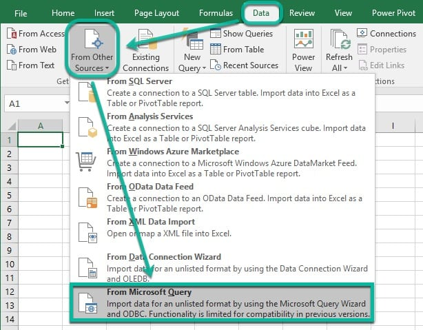

3.在“选择数据源”弹出窗口中，选择先前安装的Hortonworks ODBC数据源，然后单击“ **确定”**。

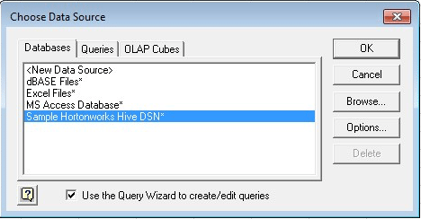

4.在“查询向导”中，选择**avg_mileage**表并向查询添加列，然后单击“ **下一步”**。

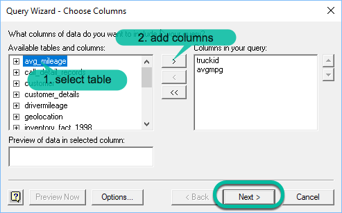

5.对于以下“查询向导”表单，接受默认值并单击“ **下一步”**。

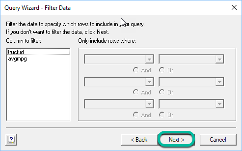

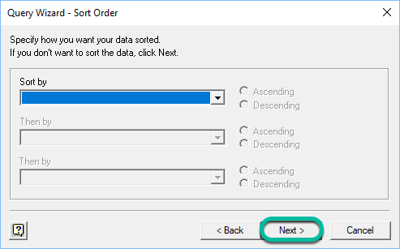

在最后一个表单上，单击“ **完成”**。

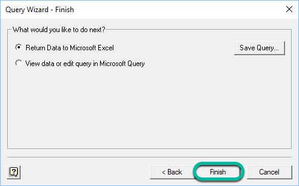

6. Excel将向Hive发送数据请求。返回数据时，它会询问您导入表的位置。接受默认位置以导入表：当前工作簿，当前工作表，单元格`$ A $ 1 ` - 单击“ **确定”**。

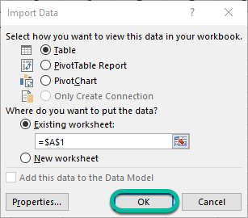

我们已成功将表**avg_mileage**  导入Excel。现在我们准备做一些可视化。

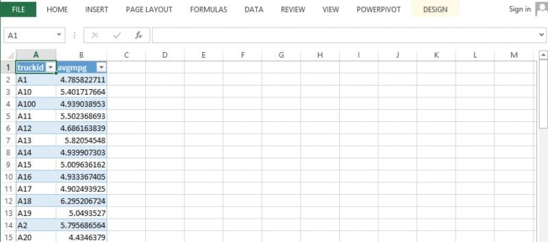

## 使用MICROSOFT EXCEL可视化数据

我们将使用Power View来模拟我们的数据。

1.点击[](https://2xbbhjxc6wk3v21p62t8n4d4-wpengine.netdna-ssl.com/wp-content/uploads/2017/06/excel-power-view-icon.png)。您在Power View先决条件中创建了此图标。默认设置是创建Power View工作表，单击“ **确定”**。

2.我们将创建一个柱形图，直观地描述每辆卡车的平均每加仑英里数。选择**DESIGN** > **Column Chart** > **Stacked Column**。您需要通过将图表的右下角拖动到整个窗格来拉伸图表。您可以通过过滤**avgmpg**和/或**truckid**来控制您看到的数据量。

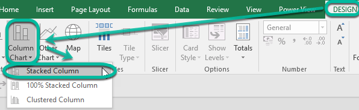

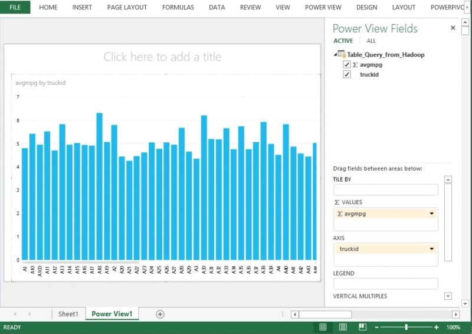

继续我们的下一个可视化图片

我们将使用来自表格**地理位置的**数据。我们在[*Hive - Data ETL*](https://zh.hortonworks.com/tutorial/hadoop-tutorial-getting-started-with-hdp/section/3/)部分创建了这个表。我们将创建一个描述每辆卡车位置的地理地图。我们将使用以下查询从表中收集**driverid**，**city**和**state**。

```
SELECT driverid ，city ，state FROM geolocation ;
```

1.选择“ **数据”** >“ **新建查询”** >“ **从其他来源”** >“ **从ODBC”**

[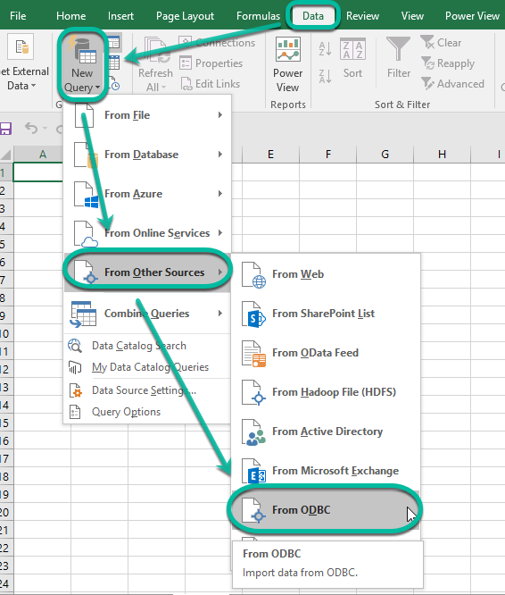

2. *从ODBC*表单填写如下：

- **数据源名称（DSN）**：*<您创建的数据源名称>*
- 在*高级选项*，**SQL语句（可选）下**，键入：`SELECT driverid, city, state FROM geolocation;`
- 按**确定**

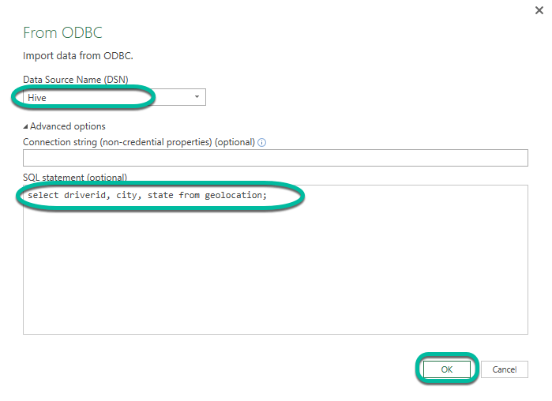

3. Excel将显示查询结果的示例集。单击“ **加载”**以创建新工作表并导入数据。

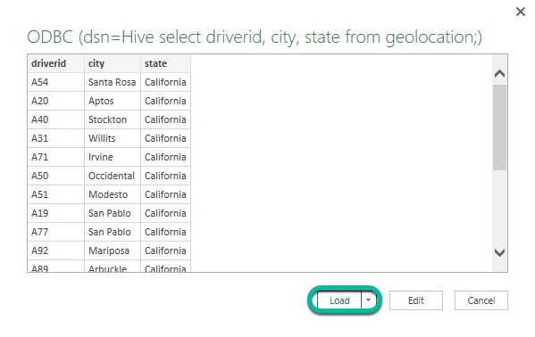

4.点击[](https://2xbbhjxc6wk3v21p62t8n4d4-wpengine.netdna-ssl.com/wp-content/uploads/2017/06/excel-power-view-icon.png)。您在Power View先决条件中创建了此图标。默认设置是创建Power View工作表，单击“ **确定”**。

我们将创建一个地图，用于直观地描述每辆卡车的位置。选择**DESIGN** > **Map**。您需要通过将图表的右下角拖动到整个窗格来拉伸图表。

> 确保您具有网络连接，因为Power View使用Bing进行地理编码，将城市和州列转换为地图坐标。

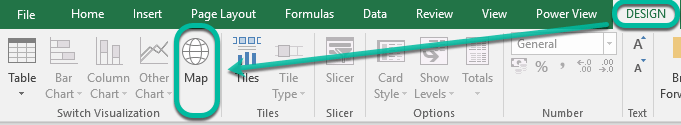

- 取消选中**driverid**。我们只希望看到**的城市**和**国家**。

完成的地图看起来像这样。

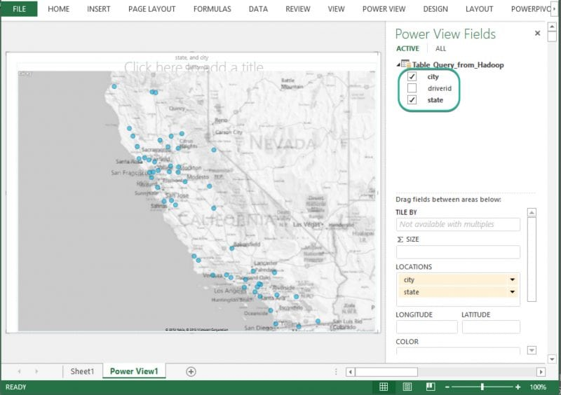

## 概要

恭喜！您可以使用Microsoft Excel可视化您的数据。

本教程展示了Hortonworks Data Platform（HDP）如何使用Microsoft Excel存储和可视化地理位置数据。您可以使用许多其他商业智能（BI）工具。

您可以进一步探索其他可视化，例如绘制风险系数或每加仑英里数作为条形图。

## 进一步阅读

作为Hadoop实践者，您可以选择三个基本角色来建立您的技能：

- [开发者](https://zh.hortonworks.com/tutorials/?filters=developer)
- [管理员](https://zh.hortonworks.com/tutorials/?filters=administrator)
- [数据科学家](https://zh.hortonworks.com/tutorials/?filters=data-scientist-analyst)

**案例研究**

通过以下案例研究了解有关Hadoop的更多信息：

- [数据仓库架构](https://zh.hortonworks.com/solutions/edw-optimization/)
- [行业解决方案](https://zh.hortonworks.com/solutions/)
- [O`Reilly的权威指南](http://hadoopbook.com/)
- [Hadoop for Dummies](http://www.wiley.com/WileyCDA/WileyTitle/productCd-1118607554.html)


