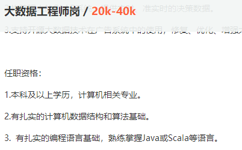
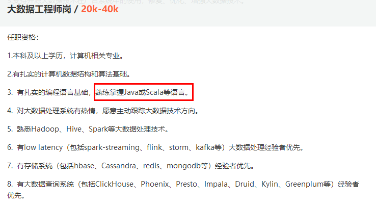

## 首先我可以先把以前的资料找出来

## 对全部知识做一个规划

## 重点突破哪一部分

## 同时要考虑到学生的基础, 不要把难度过高/掌握成本高昂的内容添加进去

## 考虑学习曲线问题, 设计学生比较合适的学习路线, 模块的学习时间.

## 后期目标是能够优化我们的课程

大数据方向可能涉及到的知识版块:

从学习的前后逻辑顺序

## 1. Vmware WordStation

虚拟机软件
难度比较低

## 2. Linux操作系统
- Ubantu
- Centos

Ubantu 64位中文版
Ubantu 英文版
Centos 有桌面版本
Centos 无桌面核心版

### 2.1 搭建复杂的集群需要对网络方面特别精通

所以重点是网络方面的知识
shell语法
Linux操作语法

## 3. Hadoop --- 分布式集群系统的基础架构

Hadoop是目前大数据开发的标准, 是整个分布式系统的核心, 重要程度不言而喻

包含: 
### 3.1 HDFS 文件管理系统

### 3.2 MapReduce  --- 不重要

### 3.3 YARN Hadoop 资源管理器  --- 不重要

### 3.4. Hadoop的各种版本选择

#### 3.4.1 Apache 社区版

优点
1. 完全开源, 免费
2. 版本更新快
3. 社区活跃
4. 文档详细

缺点: 

1. 复杂的版本管理。版本管理比较混乱的，各种版本层出不穷，让很多使用者不知所措。
2. 复杂的集群运维, 各组件之间的连通, 管理关系非常复杂
3. 搭建分布式集群, 需要的操作很多, 学习成本高昂, 实用性低
4. 稳定性差, 容易出现各种各样的问题, 常常要花大量时间解决各种问题.

#### 3.4.2 第三方发行版本

由于以上的种种原因, 更好的方法是直接使用第三方发行版本

优点: 
1. 和社区版同样基于Apache协议，100%开源。
2. 版本管理清晰。
3. 比Apache Hadoop在兼容性、安全性、稳定性上有增强。第三方发行版通常都经过了大量的测试验证，有众多部署实例，大量的运行到各种生产环境。
4. 版本更新较快。
5. 基于稳定版本Apache Hadoop，并应用了最新Bug修复或Feature的patch. (一般来说发行版不会使用最新版本的Hadoop, 而是使用前几个版本已经确定可以稳定运行的版本)
6. 提供了部署、安装、配置工具，大大提高了集群部署的效率，可以在几个小时内部署好集群。
7. 运维简单。提供了管理、监控、诊断、配置修改的工具，管理配置方便，定位问题快速、准确，使运维工作简单，有效。

因此, 我们的课程, 更改成使用第三方发行版, 应该是一个更好的选择.

#### 3.4.3 目前常见的第三方发行版

排名前十的Hadoop发行版中，只有CDH、HDP、Apache、MapR是开源的软件，其他都是闭源软件，暂时不参与讨论

1. Cloudera的CDH
2. Hortonworks的HDP

##### CDH 

> 最成型的发行版本，拥有最多的部署案例。提供强大的部署、管理和监控工具。Cloudera开发并贡献了可实时处理大数据的Impala项目。拥有强大的社区支持，当出现一个问题时，能够通过社区、论坛等网络资源快速获取解决方法。

##### HDP

> 不拥有任何私有修改地使用了100%开源Apache Hadoop的唯一提供商。
> 
> Hortonworks是第一家使用了Apache HCatalog的元数据服务特性的提供商。
> 
> 并且，它们的Stinger开创性地极大地优化了Hive项目。
> 
> Hortonworks为入门提供了一个非常好的，易于使用的沙盒。
> 
> Hortonworks开发了很多增强特性并提交至核心主干，这使得Apache Hadoop能够在包括Windows Server和Windows Azure在内的Microsft Windows平台上本地运行,相比于CDH只能运行在Linux系统中。

## 3. Spark 

目前最主流的, 专为大规模数据处理而设计的, 快速通用的计算引擎 .

地位与Hadoop不相上下, 是大数据生态系统中的重要组成部分, 是我们学习大数据中的重中之重.

值得花费更多的时间去进行学习.

## 4.其他组件

熟悉分布式管理框架，有docker/Mesos/Kubernets等项目经验的优先 

熟悉深度学习框架（MXNet，Caffe，Tensorflow）优先考虑 

## 一个想法:

我们原来的课程中存在的一些问题

1. 首先, 原来我们的课程中含有四门编程语言的学习: Java, Scala, Python, SQL

三个月时间, 需要学习四门不同的语言, 这样的内容, 对于学生来讲, 过于的不友好.

会导致每一门编程语言都只学了一点皮毛, 无法达到实际应用, 甚至达不到完成面试题的标准.

因此砍掉一门不重要的编程语言是一个可行的方案.

2. 课程体系过时

在课程中使用的软件版本太老, 跟不上目前企业实际应用的场景需求.

使用部分组件目前已经快要被淘汰, 使用率低, 例如 Spark Mllib, Spark1.4 , Hadoop2.2等早就已经过时.

3. 之前因为一台机器内存不足, 所以无法运行较新版本Hadoop生态系统的问题, 可以通过一个学生使用两台或者三天机器搭建集群的方式进行解决.
  > 因为现场学生数量不多, 闲置机器很多, 因此完全可以一个学生使用两台电脑, 将三个或者四个集群分布在两台电脑上运行.
  >
  > 这样一来, 首先集群的搭建不在局限在一台电脑上, 更加贴近生产环境.
  >
  > 同时对于机器的配置更低了, 可以搭建更高的版本集群.

我们的课程是大数据分析师

而不是大数据开发,或者是大数据架构师等

### 因此我们的重点应该是

使用分布式集群进行**数据处理, 数据分析, 数据可视化, 流式数据处理,  机器学习, 深度学习**等工作.

而不是将过多的时间, 耗费在学习如何搭建一个非常复杂的集群.

1. 首先可以把Java课程删除
> 通过第三方发行版本安装Hadoop集群, 学习成本会降低因为在短暂的学习中, 无法对Java这门复杂的编程语言达到能够应用的水平, 而且在后续的学习和工作中, 使用Java的场景很少
> 
> 同时学生普遍反映Java学了之后没有实际作用.

2. 对用人单位来讲通常掌握Java或者Scala其中一门即可

可以将原来为三天的Scala 编程学习时间增加为5天左右

2. 集群搭建课程时间可以进行压缩
> 整个大数据环境搭建, 管理, 可以压缩成两天时间

 low latency 低延迟数据处理

 （包括spark-streaming、flink、storm、kafka等）大数据处理经验者优先。

### 学习搭建集群的目的是:

1. 熟悉大数据的工作环境
2. 如果将来工作时, 公司没有相关开发经验, 可能需要你自己搭建集群, 因此要掌握自己搭建集群的能力
3. 在面试大数据分析师的岗位, 面试时通常要提问一些大数据搭建方面的工作, 如果具有搭建分布式系统的能力, 无疑会增加很多评分.

在一楼大数据实验室中, 布置一个30个节点的大数据开发平台.

完全实现真实环境下, 大数据运行环境, 可以

因版本更新较快, 有很多组件会被开源出来, 因此要不断进行更新优化, 研究企业大数据系统发展趋势.

Hadoop/HBase/Spark/Kafka

