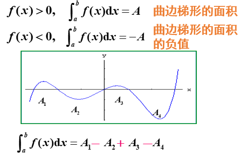

# 微积分

**微积分是关于两个函数之间关系的学科**

很少用到极限, 能用微积分的就用微积分.

导数和微分, 偏导数, 导数与极值的应用 这些是最重要的.

小tips , 对于那种95%都是缺失值的数据, 你可以考虑把有数据的都标1, 把没有数据的都标0, 把二元变量扔到模型里, 标1的人是原因提供这个变量信息的, 标0是不愿因提供的.

## 第一章 函数

R: 实数集  R~+~ : 正实数集   R~-~ : 负实数集

N: 自然数集合(包含0)  N~+~ : 正整数集

Q : 有理数集  

 ∀ : 任意 (在数学里, 你进到就翻译成所有)

∃ : 存在

Z :整数集

- y = f(x)   y 因变量  x 自变量
- f(x0) 为函数在x0处的函数值
- 函数不一定能写成y = f(x) 这个样子, 例如中位数

y = lnx .... f(x) = lnx  .... f(x~1~, x~2~ ; a ,  b) = ln(x~1~) + x~2~^2^ + a + b

函数也可以写成映射的形式

> f : R^+^ --> R     (第一行写的是映射)
>
> ​	x |--> y = lnx   # 第二行写的是映射的规则

### 函数的四个性质

1. 函数的有界性

   m ∈ R , 有 m ≤ f(x) 下阙界   m ≥ f(x) 上阙界

   函数的极值得是你的函数能真实取到的值, 而上下阙界到不了也没关系

2. 函数的单调性

   x1 < x2 , 有 f(x1) ≤ f(x2) , 如果没有等号, 就是严格单调增 

3. 函数的奇偶性

   f(-x) = f(x)   奇函数

   f(-x) = -f(x)  偶函数

4. 函数的周期性

   如果f(x+T) = f(x)  就是周期函数

### 反函数

y= f (x) 与y= f ^-1^(x)的关系是x、y互换，它们的图形关于y=x对称。 

y= f (x)单调单值，则y= f ^-1^(x)单调单值。 

### 复合函数

### 六类函数称为基本初等函数

1. 常量函数   y = C (c为常数)

   

2. 幂函数 y = x^a^  (a 为实数)

   

   幂函数可能是大家以后用的最常用的一张函数形式

3. 指数函数 y=a^x^ (a>0 , a != 1)

   

4. 对数函数 y= log~a~x  (a > 0 , a!= 1)

   

   指数与对数, 互为反函数

   

5. 三角函数  y = sinx ,  y =  cosx,  y = tanx ,  y= cotx

6. 反三角函数(没用)

定义  凡是由常数和基本初等函数经过有限次四则运算及有限次的函数复合所构成并可用一个式子表示的函数，称为初等函数.   

非初等函数(例 狄利克雷函数 )

主要是用于构建反例用的

### 初等函数的运算

## 第二章 极限

###    1. 数列极限

迫敛性 (夹逼准则) 

比如我有两个数列, a--> 极限0  b---> 极限0, 这个时候我有一个数列c, c永远夹在a和b之间, 则c的极限也是0

四则运算法则

数列极限存在的条件

判断数列是否收敛, 这在极限理论中占有非常重要的地位

1. 单调有界定理

   函数单调减的, 且有下界, 则这个下界就是他的极限

   函数单调增的, 且有上界, 则这个上界就是他的极限

2. 柯西收敛准则

   

   柯西收敛准则的意义在于: 可以根据数列通项本身,的特征来判断该数列是否收敛.

###    2. 函数极限

这部分没啥意思, 不想记了, 如果需要去查课件吧

## 第三章 微分

###    1. 函数的连续性

###    2. 导数和微分

#### 导数的定义

#### 常用导数公式

#### 导数的作用--求极值

#### 求导法则

1. 导数的四则运算

   

   

   

2. 复合函数的导数

   

   

#### 高阶导数

每一阶导数都是描述上一阶函数的变化率

莱布尼茨公式

###    3. 偏导数

混合偏导, 高阶偏导, 你就按照函数一个一个求就可以了

###4.梯度

在一个点上, x方向有导数, y方向有, 实际上360度方向上都可以找到切线.梯度说的就是, 这所有方向的导数里面, 导数最大的一个, 或者说是斜率最大的一个.

这个就叫做**梯度**, 梯度没有方向.

梯度有什么用?

曲面上一个点360°里面, 梯度最大的一个, 那你沿着梯度方向一直在, 你就应该最快的到达函数的最小值.极小值.

梯度是为了让我们快速的找到极值点.

比如说你找了一个数据模型出来, 那里面有很多参数, 你要调优.

你就对所有参数构建出一个损失参数了出来, 一边情况下你构建出的就是一个多维曲面.

你先找出曲线上的一点, 你算一个梯度的方向, 你沿着方向走, 你不就走的最快了吗!

我们以后看到的曲面可能是一个凹凸的曲面, 你走一段, 重新找一下梯度, 然后再沿梯度继续走.

这样做, 可以在一定程度上, 最快速度的找到极小值, 你找到了极小值, 就找了原函数最优的情况.

可能存在的问题: 你找到时候, 可能找到了一个局部最小值, 你就认为它是最小值, 你就会发现它不对.

这就是一个比较麻烦的情况了, 最原始的梯度下降, 是有局限的.

例如有这么一个解决办法, 假如有一个小球, 我给它一个初速度, 它可能会扔过那个局部最小值, 这样就知道了我们找到的是局部最小值.

## 第四章 微分的应用

微分就是导数的一个变化形式, 微分就是找近似计算

老师推荐比较好用的微分计算公式:

###    1. 洛必达法则

本质上是用来解决未定式的问题的.

例如0/0  或者 ∞/∞的问题的

例如:

> f(x) = x^2^ +1
>
> g(x)= -x^2^ +1
>
> f(x)/g(x) 当x 等于 +/-  1的时候, 就是0/0

对于这种东西, 你直接算导数相除, 直接算, 算不出来

改成算 f'(x)/g'(x) = 2x /-2x = -1

###    2. 导数与极值的应用

导数可以解决的下一个问题, 求极值问题.

当x取到这个值的时候, 函数可以取到极大值或者极小值, 则这个x就叫做极值点.

费马定理: 如果这个点是极值点, 则这个点导数一定为0

反着用: 我们先找出那些导数为0的点, 我们叫做驻点, 然后我们判断一下这些驻点, 是不是极值点, 就可以了.我们找到的那些驻点, 并不一定是极值点.

例如 y=x^3^  在x=0的点是驻点, 但并不是极值点.

==(这个办法不太常用)==第一充分条件: 看一下导数是先正后负还是先负后正的, 如果导数先负后正, 原函数取到最小值, 如果导数先正后负, 函数取到极大值.

如果导数先正后正, 或者先负后负, 它就不是极值点.

(==我们常用的办法==)设f(x)在x~0~处具有二阶导数, 且f'(x) != 0 , 那末

(1) 当f''(x) < 0 时, 函数f(x)在x~0~处取得极大值, 是一个开口向下的凹函数

(2) 当f''(x) > 0 时, 函数f(x)在x~0~处取得极小值, 是一个开口向上的函数

###    3. 泰勒公式

近似计算用的, 用来拆解函数.--> 假如有一个函数我们不好解, 我们就把它拆成多项式的形式,这样就非常好处理了.

第二个作用, 拼函数用的, 我们看到一个散点图, 是一个非正常的函数, 如果你想要建立回归模型, 你得给出函数表达式啊, 直接写写不出来, 我们就可以通过泰勒公式, 在一定准确度下拼出这个函数的表达式.

泰勒中值定理, 如果函数f(x)在含有x~0~的某个开区间(a, b)内具有直到(n+1)阶的导数, 则当x在(a,b)内时, f(x) 可以表示为(x - x~0~) 的一个n次多项式, 与一个余项R~n~ (x) 之和:

> 
>
> 

#### 常用函数的麦克劳林公式

 

## 第五章 定积分

### 定积分的几何意义:

它是介于x轴, 函数f(x)的图形及两条直线x=a, x=b之间的各部分面积的代数和, 在x轴上方的面积取正好, 在x轴下方的取负号.

只要你能把定积分算出来, 它一定就是一个可积的函数.

定理1:若函数f(x)在区间[a, b]上连续, 则f(x)在区间[a,b]上可积

定理2: 设函数 f(x) 在区间[a, b] 上有界, 且只有有限个间断点, 则f(x)在区间[a, b] 上可积.

### 定积分的性质

## 第六章 级数

级数用的也不多, 主要部分就是泰勒公式

另外的50% 就是傅里叶级数, 三角函数拼出来的, 在现代数据分析中, 只用于时间序列.

### 级数的基本概念

级数是用来解决无穷个数相加的问题

1+(-1)+1+(-1)+L

把前两个化作一组, 等于0

把后面2个3个化作一组, 结果为1

第一个问题, 无数个数相加, 和是否存在

第二个问题, 如果能相加, 那我们就来找一个公式, 来算出来.

由图上知, 首先数列得有极限, 就是收敛的, 只有这种收敛的级数可以求和.

上边的那个例子不能求和.

### 幂级数

一般项为
$$
a_n(x-x_0)^n
$$
的函数项级数称为幂级数, 这是一类最简单的函数项级数.它是代数多项式的推广.幂级数在级数理论中有着特殊的地位, 在函数逼近和近似计算中有重要应用, 特别是函数的幂级数展开为研究非初等函数提供了有力的工具.  

### 重要：常用已知和函数的幂级数

### 泰勒公式

若f(x)在点x~0~的某邻域内有直到n+1阶的连续导数, 则

#### 泰勒级数

若在(1)中去掉余项R~n~(x), 那么在点x~0~附近f(x)可用(1)式右边的多项式去近似替代, 如果f(x)在x=x~0~处存在任意阶的导数, 这时称形式为, 

的级数为f(x) 在x~0~的泰勒级数

