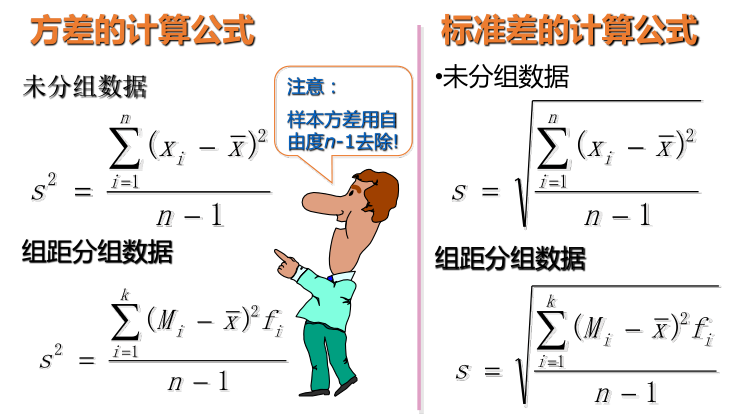

## 统计学基础知识点总结

现代统计学的级数是微积分, 是实分析

1. 集中趋势
2. 离散趋势
3. 偏度峰度

**注意:以后所有和总体有关系的东西都用希腊字母表示, 所有和样本有关系的我们都用英文字母来表示.**

总体平均数μ, 样本平均数x

简单平均数(Simple mean)

设一组数据为:x1 , x2, ..., xn(总体数据x~N~)

### 平均数 

$$
\overline x = \frac{x_1+x_2+...+x_n}{n} =  \frac{\sum_{i=1}^nx_i}{n}
$$

### 总体平均数

$$
\overline μ = \frac{x_1+x_2+...+x_n}{N} =  \frac{\sum_{i=1}^Nx_i}{N}
$$

总体平均数是个定值，样本平均数会随抽样而改变。

### 加权平均数 (Weighted mean)

### 几何平均数 (geometric mean)

1. n个变量值乘积的n次方根
2. 适用于对比率数据的平均
3. 主要用于计算平均增长率
4. 计算公式为

$$
G_m = \sqrt[n]{x_1 \times x_2 \times ...\times x_n} = \sqrt[n]{\prod_{i=1}^nX_i}
$$

5. 可以看做是平均数的一种变形

$$
lgG_m = \frac{1}{n}(lgx_1+lgx_2+...+lgx_n) = \frac { \sum_{i=1}^nlgX_i}{n}
$$

## 众数、中位数、平均数的特点和应用

1.众数

- 不受极端值影响
- 具有不惟一性
- 数据分布偏斜程度较大且有明显峰值时应用

2.中位数

- 不受极端值影响
- 数据分布偏斜程度较大时应用

3.平均数

- 易受极端值影响
- 数学性质优良
- 数据对称分布或接近对称分布时应用

## 离散程度的度量

度量数据的分散程度, 换句话说, 度量数据的波动性

#### 离中趋势

1. 数据分布的另一个重要特征
2. 反映各变量值远离其中心值的程度(离散程度)
3. 从另一个侧面说明了集中趋势测度值的代表程度
4. 不同类型的数据有不同的离散程度测度值

分类数据：异众比率 (variation ratio)

  1. 对分类数据离散程度的测度
  2. 非众数组的频数占总频数的比例
  3. 计算公式为

$$
V_r = \frac{\sum f_i - f_m}{\sum f_i} = 1 - \frac{f_m}{\sum f_i}
$$

4. 用于衡量众数的代表性

#### 极差 (range)

1. 一组数据的最大值与最小值之差
2. 离散程度的最简单测度值
3. 易受极端值影响
4. 未考虑数据的分布
5. 计算公式为

$$
R = max(x_i)- min(x_i)
$$

#### 平均差 (mean deviation)

1. 各变量值与其平均数离差绝对值的平均数

2. 能全面反映一组数据的离散程度

3. 数学性质较差，实际中应用较少(最小离差回归)

4. 计算公式为

   未分组数据
   $$
   M_d = \frac{\sum_{i=1}^n \left |x_i - \overline x  \right |}{n}
   $$
   分组数据
   $$
   M_d = \frac{\sum_{i=1}^k \left |M_i - \overline x  \right |f_i}{n}
   $$

但是平均差因为有绝对值, 没有办法求导, 我们为了能求导所以用方差.

#### 方差和标准差(variance and standard deviation)

1. 数据离散程度的最常用测度值
2. 反映了各变量值与均值的平均差异
3. 根据总体数据计算的，称为总体方差(标准差)，
  记为$ \sigma ^2(\sigma) ​$, 根据样本数据计算的，称为样本方
  差(标准差)，记为s^2^(s)

#### 总体方差和标准差

(Population variance and Standard deviation)

#### 样本方差和标准差

(sample variance and standard deviation)

#### 自由度(degree of freedom)

1. 自由度是指数据个数与附加给独立的观测值的约束或限制的个数值差
2. 从字面含义来看, 自由度是指一组数据中可以自由取值的个数
3. 当样本数据的个数为n时, 若样本平均数确定后, 则附加给n个观测值的约束个数就是1个, 因此只有n-1个数据可以自由取值, 其中必有一个数据不能自由取值.
4. 按照这一逻辑, 如果对n个观测值的附加的约束个数为k, 则自由度为n-k
5. 为什么样本方差的自由度为什么是n-1呢？因为在计算离差平方和时，必须先求出样本均值 ，而x则是附件给离差平方和的一个约束，因此，计算离差平方和时只有n-1个独立的观测值，而不是n个

#### 标准分数 (standard score )

也叫标准化

1. 对某一个值在一组数据中相对位置的度量

2. 可用于判断一组数据是否有离群点(outlier)

3. 用于对变量的标准化处理

4. 计算公式为
   $$
   Z_i = \frac {X_i - \overline x}{S}
   $$

标准分数的性质:

> z分数只是将原始数据进行了线性变换，它并
> 没有改变一个数据在该组数据中的位置，也没有改
> 变该组数分布的形状，而只是使该组数据均值为0，
> 标准差为1

标准化的三种理解方式

1. 第一个角度: 分子算的是到均值的距离, 分母是标准差, 其实是在看距离是标准差的多少倍
2. 第二个角度: 可以理解成, 去量纲, 展开成$ \frac {x_i} {S} - \frac {\overline x}{S} $  
3. 第三个角度: 从图像上来看, 减去均值后, 等于把图像平移到0点, 除以标准差, 等于让图像伸缩.

因此可以从三个角度来理解, 标准化在做什么事情.

如果数据是对称分布的, 约有68%在数据的一倍标准差之内, 约有95%数据在2倍标准差之内, 约有99%的在3倍标准差之内.

#### 离散系数

是把标准差给标准化的系数

1. 标准差与其相应的均值之比

2. 对数据相对离散程度的测度

3. 消除了数据水平高低和计量单位的影响

4. 用于对不同组别数据离散程度的比较

5. 计算公式为
   $$
   V_s = \frac {S}{\overline x}
   $$

### 偏态

1. 统计学家Pearson于1895年首次提出
2. 数据分布偏斜程度的测度
  偏态系数=0为对称分布
  偏态系数> 0为右偏分布
  偏态系数< 0为左偏分布
  偏态系数大于1或小于-1，被称为高度
  偏态分布；偏态系数在0.5～1或-1～-0.5之间，被认为是中等偏态分布；偏态系数越接近0，偏斜程度就越低
3. 偏态系数是已经去量纲后的参数（除以标差）

#### 偏态系数(coefficient of skewness)

公式不需要计算

1. 根据原始数据计算

   

  
   $$
   SK = \frac{n \sum (x_i - \overline x)^3}{(n-1)(n-2)s^3}
   $$

2. 根据分组数据计算
   $$
   SK = \frac{ \sum_{i=1}^k (M_i - \overline x)^3f_i}{ns^3}
   $$

### 峰态 (kurtosis)

1. 统计学家Pearson于1905年首次提出
2. 数据分布扁平程度的测度
3. 峰态系数=0扁平峰度适中
4. 峰态系数<0为扁平分布
5. 峰态系数>0为尖峰分布
6. 峰态系数同样去了量纲

#### 峰态系数(coefficient of kurtosis)

公式略, 太复杂

## 统计量 (statistic)

1. 设X1, X2, ... Xn是从总体X中抽取的容量为n的一个样本, 如果由此样本构造一个函数T(X1, X2, ...Xn), 不依赖于任何未知参数, 则成函数T是一个统计量
2. 样本均值, 样本比例, 样本方差等都是统计量
3. 统计量是样本的一个函数
4. 统计量是统计推断的基础
5. 中位数, 四分位数等叫做次序统计量

### 抽样分布 (sampling distribution)

1. 样本统计量的概率分布，是一种理论分布

   > 在重复选取容量为n的样本时，由该统计量的所有可能取值形成的相对频数分布

2. 随机变量是样本统计量

   > 样本均值,样本比例，样本方差等

3. 结果来自容量相同的所有可能样本

4. 提供了样本统计量长远而稳定的信息，是进行推断的理论基础，也是抽样推断科学性的重要依据

### 分布函数(略)

小于等于指定值的概率之和

### 密度函数(略)

在这个小范围内, 小球出现的概率是多少

### 正态分布

设 −∞ < 𝜈 < +∞，𝜎 > 0，则由下列密度函数
$$
f(x) = \frac {1}{\sigma \sqrt{2π}}e^{(-\frac {(x-μ)^2}{2σ^2})}   ,  -\infty  < x < + \infty
$$
确定的随机变量 X 的分布称为正态分布, 记为

$ N(\mu, \sigma^2) $

又称为高斯分布

#### 标准正态分布

μ等于0, σ等于1
$$
f(x) = \frac {1}{\sqrt{2π}}e^{- \frac{x^2}{2}}
$$
μ 描述正态分布的集中趋势
σ 描述正态分布的离散程度
σ越大，数据分布越分散；σ越小，数据分布越集中。

#### 正态分布曲线下面积

•  68.27%的面积在平均值左右的一个标准差范围内
•  95.45%的面积在平均值左右两个标准差2σ的范围内
•  99.73%的面积在平均值左右三个标准差3σ的范围内
•  99.99%的面积在平均值左右四个标准差4σ的范围内

正态分布的数学式:

高斯先提出了极大似然估计: 一次抽样, 正好抽到了这些样本值, 那我就认为这些时间联合发生的概率是最大的.

只有当你的函数式这样的一个解析式, 才可以满足我们说的那个极大似然估计的假设.

后来其他统计学家也从其他方面推导出来了.

## 由正态分布推导出来的三种分布

这三个分布你很难在自然界中找到, 这三个分布是人为构建出来的.

### 卡方分布

**卡方分布是用来分析方差用的**, 用来分析数据的波动大小, 多个标准正态分布的平方和.

X相似于正态分布,X ~ N(μ,σ^2^ )  则 $ z = \frac{X - μ}{σ} 服从 N(0, 1) $

令 Y = z^2^, 则Y服从自由度为1的 卡方分布χ

多个标准正态分布的平方和, 叫做卡方分布, 别忘了自由度减去1.

口诀: 多个标准正态分布的平方和, 叫做卡方分布

随着样本容量的增大, 卡方分布, 会慢慢的趋近于正态分布

如果你可以抽无数个样本, 你算出来的卡方分布, 和正态分布一样.

当样本数 大于20时, 就基本上形成正态分布了.

医药公司, 20个就是大样本了.

工业领域30个样本, 叫做大样本

社会学领域, 商业领域, 经济学领域200个叫做大样本.

1. 分布的变量值始终为正
2. 分布的形状取决于其自由度n的大小，通常为不
  对称的正偏分布，但随着自由度的增大逐渐趋
  于对称
3. 期望为：E( χ^2^ )=n，方差为：D( χ^2^ )=2n(n为
  自由度)
4. 可加性：若U和V为两个独立的 χ^2^ 分布随机变量，
  U~ ^2^2 (n~1~ )，V~ χ2 (n~2~ ),则U+V这一随机变量服
  从自由度为n~1~ + n~2~ 的 χ^2^ 分布

### t分布

若随机变量 X 服从标准正态分布N(0,1)，

随机变量Y服从自由度为n的卡方分布𝜒^2^ (n) ，且X与Y独立，

用来做小样本分布

用笔名Students发布的笔名, 因此我们把t取出来, 叫做t分布.

t分布式从正态分布, 搞出来的, 所有它的形态也会随着样本的增大

标准正态分布, 除以均方的根, 就是t分布.

随着自由度的增大, 分布也会逐渐趋于正态分布

X服从标准正态分布

Y服从自由度为n的卡方分布, X与Y独立

则随机变量 $ t = \frac {X}{\sqrt{\frac{Y}{N}}} $

密度函数过于复杂, 略

称为自由度为n的t分布（或，学生氏分布）

### F分布

均方之比, 就是F分布, 是用来对比方差的.

设若U为服从自由度为n 1 的 χ2 分布，即U~ χ2 (n 1 )，V为服从自由度为n 2 的 χ2 分布，即V~ χ2 (n 2 ),且U和V相互独立，则称F为服从自由度n 1 和n 2 的F分布，记为
$$
F = \frac {U/n_1}{V/n_2}
$$

$$
F --> F(n_1,  n_2)
$$

F分布有两个自由度, 分别是分子自由度和分母自由度, 分子自由度越大越趋近于正态分布图像.

主要是用来对比方差用的,   如果小于1 就是上面的

口诀: 均方之比就叫做F分布, 是用来对比方差的

## 样本均值的抽样分布与中心极限定理

1. 在重复选取容量为n的样本时, 由样本均值的所有可能取值形成的相对频数分布.
2. 当总体服从正态分布时, 则样本的均值x- 也服从正态分布.
3. 一种理论概率分布
4. 推断总体均值μ的理论基础

如果你能做无数次抽样, 你就可以获得无数个均值, 无数个均值也会获得一个概率分布, 就叫做样本均值的分布.

注意这里说的是任意总体, 什么总体都行, 均值都服从正态分布.

从均值为μ ，方差为 σ^2^的一个**任意总体**中抽取容量为n的样本，当n充分大时，样本均值的抽样分布近似服从均
值为μ、方差为σ^2^ /n的正态分布

**中心极限定理的前提是方差必须存在**

中心极限定理不是解决实际问题用的, 是你构建算法用的, 证明你这件事情是可以当它取到无限的时候, 是可以满足正态分布的, 我们就可以用什么东西.

## 样本比例的抽样分布

比例(proportion)

1. 总体(或样本)中具有某种属性的单位与全部单
   位总数之比

   - 不同性别的人与全部人数之比
   - 合格品(或不合格品) 与全部产品总数之比

2. 总体比例可表示为

   $ π = \frac {N_0}{N} $    或 $ 1 - π =  \frac {N_1}{N} $

3. 样本比例可表示为

   $ p = \frac {n_0}{n} $  或  $  1 - p = \frac {n_1}{n} $

4. 在重复选取容量为n的样本时，由样本比例的所有可能取值形成的相对频数分布

5. 一种理论概率分布

6. 当样本容量很大时，样本比例的抽样分布可用正态分布近似

7. 推断总体比例π的理论基础

### 数学期望与方差

1. 样本比例的数学期望

   E(p) = π

2. 样本比例的方差

   1. 重复抽样

      $ \sigma_p^2 = \frac{π(1-π)}{n} $

   2. 不重复抽样

      $ \sigma_p^2 = \frac{π(1-π)}{n} (\frac{N - n}{N-1})$

我们尽量做重复抽样, 不要做不重复抽样

## 两个样本均值之差的抽样分布

我并不关心英国人美国人赚多少钱, 我关心的是美国人收入均值和英国人收入均值是否相等, 谁多谁少差多少

1. 如果两个总体都为正态分布
2. 两个样本均值之差, 也是服从正态分布的.
3. 

## 样本方差的分布

1. 在重复选取容量为n的样本时，由样本方差的所有可能取值形成的相对频数分布

2. 对于来自正态总体的简单随机样本，则比值

   

## 可能的估计手段

### 矩估计

应用范围太小

矩:原点矩, 和中心矩

一阶原点矩 E(X)  二阶原点矩 E(X)平方

一阶中心矩

特别简单, 你就列方程就行了.

### 最大似然估计

什么地方都可以应用, 假设一次抽样正好就抽到了这些样本值

贝叶斯估计

如果你不同意最大似然估计, 你可以用贝叶斯估计, 可以去掉最大似然估计的先验假设, 

### 最小二乘估计

只能用于估计回归模型, 适用范围受限, 估计出来的回归模型, 是线性无偏, 最优的.

### EM估计

是最大似然估计的变种, 通常用于前几个办法都不能使了.

## 区间估计论文

# 线性回归算法

本文总结了线性回归算法里用到的一些微积分知识，接着根据最小均方差推导出梯度下降算法以及优化后的随机梯度下降算法。

## 微积分基本运算法则

- **法则一**：对 $y(x)=cx^n$ ，其针对 x 的偏导数为 $\frac{\partial}{\partial x}f(x)=cnx^{n-1}$

- **法则二**：常数的微分为 0

- **法则三**：偏导数可以穿透累加器，即

- $$
  \frac{\partial}{\partial x_0}\sum_{i=0}^nF(x_i) = \sum_{i=0}^n\frac{\partial}{\partial x_0}F(x_i)
  $$

- **法则四**：微分链接法则，比如 $f(x)$ 是以 x 为自变量的函数，令 $J(x)=g(f(x))$ ，则 $J(x)$ 的微分方程为 

- $$
  \frac{\partial}{\partial x}J(x) = g’(f(x))\times f’(x)
  $$

- 法则五

  ：计算偏导数时，把求导变量当作变量，其他的变量当作常数，比如对方程 $f(x, y) = ax^n + by^m$，则
  $$
  \frac{\partial}{\partial x}f(x, y) = na x^{n-1}
  $$
  因为是对 x 求导，所以可以把 y 当成常数，即 $by^m$ 整个算子就是一个常数，根据第二个法则，常数的导数为 0。同理，
  $$
  \frac{\partial}{\partial y}f(x, y) = mby^{m-1}
  $$
  维基百科上有教程可以参考，比如 [Chain Rule](https://en.wikipedia.org/wiki/Chain_rule) 和 [Partial Derivatives](https://en.wikipedia.org/wiki/Partial_derivatives)。 

## 线性回归算法

  假设我们**训练数据集 (training data set)** 有 m 个数据 $(x_0, y_0), (x_1, y_1), … (x_m, y_m)$ ，我们用线性方程 $h(x) = \theta_0 + \theta_1 x$ 来拟合这组数据，怎么样来选取参数 $\theta_0$ 和 $\theta_1$ 来最优拟合这组数据呢？

  我们可以把这 m 个点画在二维坐标系里，然后计算这 m 个点到我们的线性方程所描述的直线的最短距离，当这些点到我们的拟合直线的距离总和最小时，那么我们就找到了最优的拟合方案了。所以，问题转化为求下面函数的最小值：
$$
  J(\theta) = J(\theta_0, \theta_1) = \frac{1}{2m}\sum_{i=1}^m(h(x^{(i)}) - y^{(i)})^2
$$

  上面的公式叫**成本函数 (Cost Function)**，其中 $h(x_i)$ 是我们的拟合函数针对 $x_i$ 这个点预测出来的值。乘以 $\frac12$ 是为了计算方便，后文我们会看到。

  上面我们只考虑了一个变量 $x$ ，即决定这组数据 $y$ 值的只有一个变量。考虑更一般的情况，有 n 个变量 $x_1, x_2, x_3, … x_n$ 决定 $y$ 的值，那么我们的预测函数模型可以改写如下：
$$
  h(x) = \theta_0 + \theta_1 x_1 + \theta_2 x_2 + … + \theta_n x_n
$$
  我们让 $x_0$ 为常数 1，用累加器运算符重写上面的预测函数 
$$
  h(x) = \sum_{j=0}^n \theta_j x_j
$$

$\theta_0, \theta_1, … \theta_n$ 我们统称为 $\theta$，是我们的预测函数的 n 个**参数 (parameters)**。即一组 $\theta$ 值就决定了一个预测函数，我们记作 $h_\theta(x)$，为了简便起见，在不引起误解的情况下我们也把它简写为 $h(x)$。理论上，预测函数有无穷多个，我们求解的目标就是找出一个最优的 $\theta$ 值。 

> 考考你
>
> 当有 n 个变量 $x_1, x_2, … x_n$ 决定 y 的值的时候，训练数据集应该长什么样呢？

为了计算 $J(\theta)$ 的最小值，我们选取一组初始的 $\theta$ ，然后逐步调整 $\theta$ 的值，以便让 $J(\theta)$ 逐渐变小，最后我们希望能让 $J(\theta)$ 收敛在一个极值附近，这样我们就找到了最优或局部最优的解。$\theta$ 的迭代公式为：
$$
\theta_j = \theta_j - \alpha \frac\partial{\partial{\theta_j}}J(\theta)
$$

其中，**$\alpha$** 是叫**学习率 (learning rate)**，表示我们一次要让 $\theta_j$ 往前迈多大步子。如果步子太小，意味着要计算很多次才能到达目的地，如果步子太大，可以会直接跨过目的地，从而无法收敛。$\frac\partial{\partial{\theta_j}}J(\theta)$ 就是成本函数的**偏导数 (partial derivatives)**。

> 偏导数的物理意义
>
> 在这个公式里，可以简单地把偏导数理解为斜率。我们要让 $\theta_j$ 不停地迭代，则根据当前 $\theta_j$ 的值，我们算出 $J(\theta)$ 在 $\theta_j$ 上的斜率，然后再乘以我们的学习率 $\alpha$ 就让我们的 $\theta_j$ 往前迈了一小步。

现在问题转化为求 $J(\theta)$ 的偏导数，这个推导过程会用到文章开头部分介绍的几个微积分运算基本法则。

根据成本函数的定义，以及文章开头的几个微积分基本运算法则，我们可以求解参数迭代公式里偏微分算子。
$$
\begin{align} 
\frac\partial{\partial{\theta_j}}J(\theta) & = \frac\partial{\partial{\theta_j}} \frac{1}{2m}\sum_{i=1}^m(h(x^{(i)}) - y^{(i)})^2 \\ 
& = \frac{1}{2m}\sum_{i=1}^m \frac\partial{\partial{\theta_j}} (h(x^{(i)}) - y^{(i)})^2 \\ 
& = 2 \frac{1}{2m} \sum_{i=1}^m \left((h(x^{(i)}) - y^{(i)}) \frac\partial{\partial{\theta_j}} \left(h(x^{(i)}) - y^{(i)}\right)\right) \\ 
& = \frac{1}{m} \sum_{i=1}^m \left(\left(h(x^{(i)}) - y^{(i)}\right) \frac\partial{\partial{\theta_j}} \left(\sum_{j=0}^n \theta_j x_j^{(i)} - y^{(i)}\right)\right) \\ 
& = \frac{1}{m} \sum_{i=1}^m \left(\left(h(x^{(i)}) - y^{(i)}\right) x_j^{(i)}\right) \\ 
\end{align}
$$
式子 (2) 是根据上文的法则三得到的。式子 (3) 是根据上文的法则四得到的，这里也可以看到之前除以 2 的目的是为了抵消计算偏导数时乘以 2。式子 (5) 是根据上文的法则五得到的。

最后得出我们的参数迭代函数
$$
\begin{align} 
\theta_j & = \theta_j - \frac{\alpha}{m} \sum_{i=1}^m \left(\left(h(x^{(i)}) - y^{(i)}\right) x_j^{(i)}\right) 
\end{align}
$$
这个就是 **LSM** (Least Mean Squares) 迭代算法，也叫 **Widrow-Hoff** 学习算法。

解析一下这个公式几个关键部分的含义

- $h(x^{(i)})$: 这个是按照我们的给定的参数的预测值，只要 $\theta$ 确定了，我们就可以根据预测函数算出这个值
- $y^{(i)}$: 这个是**训练数据集 (training data set)** 的目标值
- $x_j^{(i)}$: 这个是训练数据集里第 j 个变量的值
- $\sum_{i=1}^m$: 这个是对所有训练数据集求和。从这个也可以看到每迭代一次就要遍历一次全部训练数据集。所以这个算法也称为**批量梯度下降算法 (Batch Gradient Descent)** 。对训练数据集比较大的场景下，计算成本是很高的。后面我们会介绍另外一个提高运算效率的算法。

这个公式有些符合直觉的地方，比如 $\left(h(x^{(i)}) - y^{(i)}\right)$ 表示的是预测值与真实值的误差，当误差比较大时，经过一轮的迭代，$\theta_j$ 的步幅就迈得比较大。即当我们的参数 $\theta$ 离我们的目标值很远的时候，迭代一次的值变化比较大，可以快速地收敛，而当 $\theta$ 离目标值比较近的时候，迭代一次的值变化比较小，即慢慢地收敛到目标值。

这个公式怎么样用编程语言来实现呢？在编写机器学习算法的时候，一般步骤如下：

- **确定学习率 $\alpha$** 
  $\alpha$ 太大可能会使成本函数无法收敛，太小计算太多，机器学习算法效率就比较低。
- **确定参数起始点**
  比如让所有的参数都为 1 作为起点，即 $\theta_0 := 1, \theta_1 := 1, … \theta_n := 1$。这样就得到了我们的预测函数：$h_\theta(x) = \sum_{i=1}^m x^{(i)}$。根据预测值和我们的成本函数，就可以算出我们在参数起始位置的成本。需要注意的是，参数起始点可以根据实际情况灵活选择，以便让机器学习算法的性能更高，比如选择比较靠近极点的位置。
- **计算参数的下一组值**
  根据 LSM 算法，**分别同时算出**新的 $\theta_j$ 的值。然后用新的 $\theta$ 值得到新的预测函数 $h_\theta(x)$，再根据新的预测函数，代入成本函数就可以算出新的成本。
- **确认成本函数是否收敛**
  拿新的成本和旧的成本进行比较，看成本是不是变得越来越小。如果两次成本之间的差异小于误差范围，即说明我们已经非常靠近最小成本附近了。就可以近似地认为我们找到了最小成本了。如果两次成本之间的差异在误差范围之外，重复步骤 3 继续计算下一组参数 $\theta$。直到找到我们的最优解。

## 随机梯度下降算法

批量梯度下降算法对参数进行一次迭代运算，就需要遍历所有的训练数据集。当训练数据集比较大时，这个算法的效率会很低。考虑另外一个算法：
$$
\theta_j = \theta_j - \alpha \left(\left(h(x^{(i)}) - y^{(i)}\right) x_j^{(i)}\right)
$$
这就是 **随机梯度下降算法** (stochastic gradient descent)。这个算法的关键点是不去遍历所有的训练数据集，而是改成每次随机地从训练数据集里取一个数据进行参数迭代计算。 

> 怎么理解随机
>
> 为什么这么神奇呢？为什么随机从训练数据集里选取一个数据来迭代，不但不影响最终计算结果，还大大地提高了效率。看数学时最怕的就是 **我们考虑 bla bla bla**，作者说出 “我们考虑 bla bla bla” 时背后的过程是怎么样的？坦白讲，怎么样从数学上证明随机梯度下降算法和批量梯度下降算法是等价的，我也不知道。不过我有个直观的可以帮助理解的解释。回到成本函数的定义：$J(\theta) = \frac{1}{2m} \sum_{i=1}^m \left(h(x^{(i)}) - y^{(i)}\right)^2$。我们说过，这里累加后除以 2 是为了计算方便，那么我们除以 m 是什么意思呢？答案是平均值，即所有训练数据集上的点到我们预测函数的距离的**平均值**。再回到**随机选取训练数据集里的一个数据**这个做法来看，如果计算次数足够多，并且是真正随机，那么随机选取出来的这组数据从概率的角度来看，和**平均值**是相当的。打个比方，有一个储钱罐里有 1 角的硬币 10 枚，5 角的硬币 2 枚，1 元的硬币 1 枚，总计 3 元，13 枚硬币。你随机从里面取 1000 次，每次取出来的硬币把币值记录下来，然后放回储钱罐里。这样最后去算这 1000 次取出来的钱的平均值 (1000 次取出来的币值总和除以 1000) 和储钱罐里每枚硬币的平均值 (3/13 元) 应该是近似相等的。

这样，我们基本上把线性回归算法，最小均方差，随机梯度下降算法的来龙去脉理了一遍。 

# 逻辑回归算法

## 分类问题及其表现形式

### 为什么需要逻辑回归算法

比如要对一个图片进行分类，判断图片里是否包含汽车。包含汽车的预测值为 1 。不包含汽车的预测值为 0 。这种分类问题的值是离散的，如果用 linear regresstion 来作为分类问题的预测函数是不合理的。因为预测出来的数值可能远小于 0 或远大于 1。我们需要找出一个预测函数模型，使其值的输出在 [0, 1] 之间。然后我们选择一个基准值，比如 0.5 ，如果预测值算出来大于 0.5 就认为其预测值为 1，反之则其预测值为 0.

### 逻辑回归算法的预测函数

我们选择 $g(z) = \frac{1}{1 + e^{-z}}$ 来作为我们的预测函数。这个函数称为 [Sigmoid Function](https://en.wikipedia.org/wiki/Sigmoid_function) 。它的图形如下：

从图中可以看出来，当 $z > 0$ 时，$g(z) > 0.5$ 。当 z 越来越大时，$g(z)$ 接无限接近于 1。当 $z < 0$ 时，$g(z) < 0.5$ 。当 z 越来越小时，$g(z)$ 接无限接近于 0。这正是我们想要的针对二元分类算法的预测函数。

结合我们的线性回归函数的预测函数 $h_\theta(x) = \theta^T x$，则我们的逻辑回归模型的预测函数如下：
$$
h_\theta(x) = g(\theta^T x) = \frac{1}{1 + e{-\theta^T x}}
$$
**解读逻辑回归预测函数的输出值**

$h_\theta(x)$ 表示针对输入值 $x$ 以及参数 $\theta$ 的前提条件下，$y=1$ 的概率。用概率论的公式可以写成：

$$ h_\theta(x) = P(y=1 \vert x; \theta) $$

上面的概率公式可以读成：**在输入 $x$ 及参数 $\theta$ 条件下 $y=1$ 的概率**。由概率论的知识可以推导出，

$$ P(y=1 \vert x; \theta) + P(y=0 \vert x; \theta) = 1$$

### 判定边界 Decision Boundary

**从逻辑回归公式说起**

逻辑回归预测函数由下面两个公式给出的：

$$h_\theta(x) = g(\theta^T x)$$

$$g(z) = \frac{1}{1 + e^{-z}}$$

假定 $y=1$ 的判定条件是 $h_\theta(x) \geq 0.5$，$y=0$ 的判定条件是 $h_\theta(x) < 0.5$，则我们可以推导出 $y=1$ 的判定条件就是 $\theta^T x \geq 0$，$y=0$ 的判定条件就是 $\theta^T x < 0$。所以，$\theta^T x = 0$ 即是我们的判定边界。

**判定边界**

假定我们有两个变量 $x_1, x_2$，其逻辑回归预测函数是 $h_\theta(x) = g(\theta_0 + \theta_1 x_1 + \theta_2 x_2)$。假设我们给定参数

$$\theta = \begin{bmatrix} -3 \\ 1 \\ 1 \end{bmatrix}$$

那么我们可以得到判定边界 $-3 + x_1 + x_2 = 0$，即 $x_1 + x_2 = 3$，如果以 $x_1$ 为横坐标，$x_2$ 为纵坐标，这个函数画出来就是一个通过 (0, 3) 和 (3, 0) 两个点的斜线。这条线就是我们的判定边界。

直线左下角为 $y=0$ ，直线右上解为 $y=1$ 。横坐标为 $x_1$，纵坐标为 $x_2$ 。

**非线性判定边界**

如果预测函数是多项式 $h_\theta(x) = g(\theta_0 + \theta_1 x_1 + \theta_2 x_2 + \theta_3 x_1^2 + \theta_4 x_2^2)$，且给定

$$\theta = \begin{bmatrix} -1 \\ 0 \\ 0 \\ 1 \\ 1 \end{bmatrix}$$

则可以得到判定边界函数

$$x_1^2 + x_2^2 = 1$$

还是以 $x_1$ 为横坐标，$x_2$ 为纵坐标，则这是一个半径为 1 的圆。圆内部是 $y=0$ ，圆外部是 $y=1$。

这是二阶多项式的情况，更一般的多阶多项式可以表达出更复杂的判定边界。

## 逻辑回归的成本函数

线性回归的成本函数是 $J(\theta) = \frac{1}{m} \sum_{i=1}^m \frac{1}{2} \left (h_\theta(x^{(i)}) - y^{(i)} \right)^2 $，如果我们按照线性回归的成本函数来计算逻辑回归的成本函数，那么我们最终会很可能会得到一个非凸函数 (non-convex function)，这样我们就无法通过梯度下降算法算出成本函数的最低值。

为了让成本函数是个凸函数 (convex function)，以便容易求出成本函数的最小值，我们定义逻辑回归的成本函数如下：
$$
Cost(h_\theta(x), y) = \begin{cases}      -log(h_\theta(x)), & \text{if $y$ = 1} \\      -log(1 - h_\theta(x)), & \text{if $y$ = 0} \\  \end{cases}
$$
**成本函数的解读**
如果 $y = 1, h_\theta(x) = 1$，那么成本为 $Cost = 0$；如果 $y = 1, h_\theta(x) \rightarrow 0$，那么成本将是无穷大 $Cost \rightarrow \infty$。
如果 $y = 0, h_\theta(x) = 0$，那么成本为 $Cost = 0$；如果 $y = 0, h_\theta(x) \rightarrow 1$，那么成本将是无穷大 $Cost \rightarrow \infty$。

#### 逻辑回归成本函数定义

由于 $y \in [0, 1]$ 的离散值，可以把两个成本函数合并起来：

$$J(\theta) = -\frac{1}{m} \left[ \sum_{i=1}^m y^{(i)} log(h_\theta(x^{(i)})) + (1 - y^{(i)}) log(1 - h_\theta(x^{(i)})) \right]$$

把 $y = 0, y = 1$ 两种情况代入上式，很容易可以验证成本函数合并的等价性。

#### 梯度下降公式

我们依然使用梯度下降公式来对模型进行求解。根据梯度下降算法的定义，我们使用下面的公式来进行参数迭代：
$$
\theta_j := \theta_j - \alpha \dfrac{\partial}{\partial \theta_j}J(\theta)
$$
这里的关键是求解成本函数的偏导数。在这之前，我们先求出 Sigmoid 函数的偏导数，以便后面可以利用上：
$$
\begin{align}  \sigma(x)’ &= \left(\frac{1}{1+e^{-x}}\right)’ = \frac{-(1+e^{-x})’}{(1+e^{-x})^2} = \frac{-1’-(e^{-x})’}{(1+e^{-x})^2} \newline  &= \frac{0-(-x)’(e^{-x})}{(1+e^{-x})^2} = \frac{-(-1)(e^{-x})}{(1+e^{-x})^2} = \frac{e^{-x}}{(1+e^{-x})^2} \newline  &= \left(\frac{1}{1+e^{-x}}\right)\left(\frac{e^{-x}}{1+e^{-x}}\right) = \sigma(x)\left(\frac{+1-1 + e^{-x}}{1+e^{-x}}\right) \newline  &= \sigma(x)\left(\frac{1 + e^{-x}}{1+e^{-x}} - \frac{1}{1+e^{-x}}\right) \newline  &= \sigma(x)(1 - \sigma(x))  \end{align}
$$
推导出来的这个公式将在下面用上，现在我们可以来计算成本函数的偏导数了：

最终得到梯度下降算法进行参数迭代的公式如下：
$$
\theta_j = \theta_j - \alpha \frac{1}{m} \sum_{i=1}^m \left( h_\theta(x^{(i)}) - y^{(i)} \right) x_j^{(i)}
$$
这个公式的形式和线性回归算法的参数迭代公式是一样的。当然，由于这里 $h_\theta(x) = \frac{1}{1 + e^{-\theta^T x}}$，而线性回归算法里 $h_\theta(x) = \theta^T x$。所以，两者的形式一样，但数值计算完全不同。

#### 算法优化

梯度下降算法的效率是比较低，优化的梯度下降算法有 Conjugate Gradient, BFGS, L-BFGS 等。这些算法比较复杂，实现这些算法是数值计算专家的工作，一般工程人员只需要大概知道这些算法是怎么优化的以及怎么使用这些算法即可。

octave 里提供了 `fminunc` 函数，可以查阅文档来学习函数用法，从而学会使用优化过的梯度下降算法，以提高计算效率。

#### 多元分类算法

除了二元分类算法外，还有多元分类问题，比如需要给邮件打标签，则可能有多个标签需要考虑。这个时候需要使用 one-vs-all (one-vs-rest) 的方法。即把要分类的一种类别和其他所有类别区分开来的，这样就把多元分类问题转化为二元分类问题，这样就可以使用上文总结的所有二元分类问题的算法。

针对 $y = i$，求解针对 i 的预测函数 $h_\theta^{(i)}(x)$。如果有 n 个类别，则需要求解 n 个预测函数。

 

